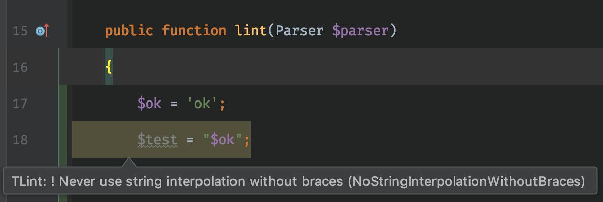
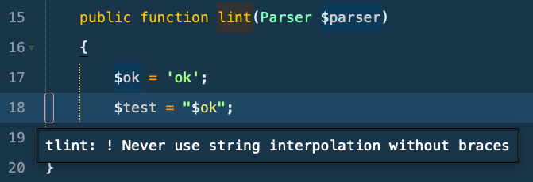
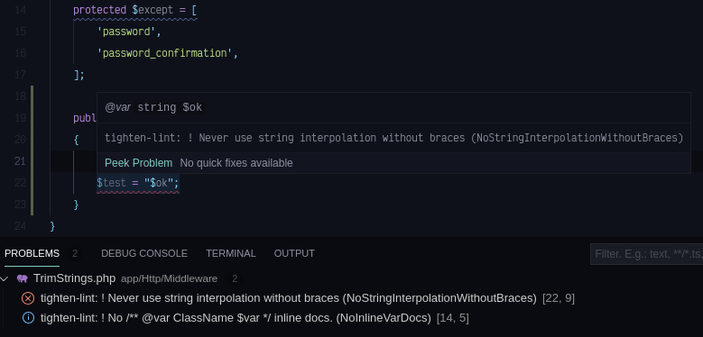

<hr>

[](https://packagist.org/packages/tightenco/tlint)

## Install (Requires PHP 7.3+)

```
composer global require tightenco/tlint
```

## Upgrade

```
composer global update tightenco/tlint
```

## What Is It?

This is an opinionated code linter (with growing support for auto-formatting!) for Tighten flavored code conventions for Laravel and PHP.

For example, Laravel has many available ways to pass variables from a controller to a view:

> **A)**

```php
$value = 'Hello, World!';

return view('view', compact('value'));
```

> **B)**

```php
return view('view', ['value' => 'Hello, World!']);
```

> **C)**

```php
return view('view')
    ->with('value', 'Hello, World!');
```

> In this case [TLint](https://github.com/tighten/tlint) will warn if you are not using the **B)** method.
> This example is a sort of "meta layer" of code linting, allowing teams to avoid higher level sticking points of code review / discussions.

> TLint also has more immediately useful lints that can supplement your editor/IDE such as:

-   `NoUnusedImports`
-   `TrailingCommasOnArrays`
-   And many more! (See below for full listing)

## Usage

For entire project (you must pass the lint command to use other options)

```
tlint
```

For individual files and specific directories

```
tlint lint index.php
tlint lint app
```

You can also lint only diff files by running the following with unstaged git changes

```
tlint lint --diff
tlint lint src --diff
```

Want the output from a file as JSON? (Primarily used for integration with editor plugins)

```
tlint lint test.php --json
```

Want to only run a single linter?

```
tlint --only=UseConfigOverEnv
```

## Example Output

```bash
Linting TestLaravelApp/routes/web.php
============
Lints:
============
! Prefer `view(...)->with(...)` over `view(..., [...])`.
5 : `    return view('test', ['test' => 'test']);``
```

## Beta Support: Formatting

Using the same conventions as above, but using the format command, you can auto-fix some lints:

```
tlint format
```

## Configuration

TLint Ships with 2 "preset" styles: Laravel & Tighten.
The Laravel preset is intended to match the conventions agreed upon by the Laravel framework contributors, while the Tighten preset is intended to match those agreed upon by Tighten team members.

The default configuration is "tighten" flavored, but you may change this by adding a `tlint.json` file to your project's root directory with the following schema:

> You may further customize the linters used by adding specific lint names to the `"disabled"` list (As shown below).
> You may disable linting for specific directories by adding them to the `"excluded"` list (As shown below).

```json
{
    "preset": "laravel",
    "disabled": ["NoInlineVarDocs"],
    "excluded": ["tests/"]
}
```

### Custom Configuration & Presets

You can also add your own custom preset and linters by providing a fully-qualified class name as the preset. For example, if you created a custom preset class:

```php
namespace App\Support\Linting;

/** use ... */

class Preset implements PresetInterface
{
  public function getLinters() : array
  {
    return [
      PrefixTestsWithTest::class,
      ModelMethodOrder::class,
    ];
  }

  public function getFormatters() : array
  {
  	return [];
  }
}
```

Then your config could look like:

```json
{
    "preset": "App\\Support\\Linting\\Preset"
}
```

This lets you define whatever custom linting functionality, or modify the existing linters to your liking.

## Editor Integrations

### [PHPStorm](https://plugins.jetbrains.com/plugin/10703-tlint)



### [Sublime](https://packagecontrol.io/packages/SublimeLinter-contrib-tlint)



### [VSCode](https://marketplace.visualstudio.com/items?itemName=d9705996.tighten-lint)



## Available Linters

## General PHP

-   No leading slashes in namespaces or static calls or instantiations. `RemoveLeadingSlashNamespaces`
-   Fully qualified class name only when it's being used a string (class name). `QualifiedNamesOnlyForClassName`
-   Class "things" should follow the ordering presented in the [handbook](https://gist.github.com/mattstauffer/1178946cb585b17a3941dd0edcbce0c4). `ClassThingsOrder`
-   Sort imports alphabetically `AlphabeticalImports`
-   Trailing commas on arrays `TrailingCommasOnArrays`
-   No parenthesis on empty instantiations `NoParensEmptyInstantiations`
-   Space after sole not operator `SpaceAfterSoleNotOperator`
-   One blank line between class constants / properties of different visibility `OneLineBetweenClassVisibilityChanges`
-   Never use string interpolation without braces `NoStringInterpolationWithoutBraces`
-   Spaces around concat operators, and start additional lines with concat `ConcatenationSpacing`
-   File should end with a new line `NewLineAtEndOfFile`
-   No /\*_ @var ClassName \$var _/ inline docs `NoInlineVarDocs` (https://github.com/tighten/tlint/issues/108)
-   There should be no unused imports `NoUnusedImports`

## PHPUnit

-   There should be no method visibility in test methods `NoMethodVisibilityInTests` (https://github.com/tighten/tlint/issues/106#issuecomment-537952774)

## Laravel

-   Use with over array parameters in view(). `ViewWithOverArrayParameters`
-   Prefer `view(..., [...])` over `view(...)->with(...)`. `ArrayParametersOverViewWith`
-   Don’t use environment variables directly in code; instead, use them in config files and call config vars from code. `UseConfigOverEnv`
-   There should only be rest methods in an otherwise purely restful controller. `PureRestControllers`
-   Controller method order (rest methods follow docs). `RestControllersMethodOrder`
-   Use the simplest `request(...)` wherever possible. `RequestHelperFunctionWherePossible`
-   Use auth() helper over the Auth facade. `UseAuthHelperOverFacade`
-   Remove method docblocks in migrations. `NoDocBlocksForMigrationUpDown`
-   Import facades (don't use aliases). `ImportFacades`
-   Mailable values (from and subject etc) should be set in build(). `MailableMethodsInBuild`
-   No leading slashes on route paths. `NoLeadingSlashesOnRoutePaths`
-   Apply middleware in routes (not controllers). `ApplyMiddlewareInRoutes`
-   Model method order (relationships > scopes > accessors > mutators > boot). `ModelMethodOrder`
-   There should be no calls to `dd()`, `dump()`, `ray()`, or `var_dump()`. `NoDump`
-   Use `request()->validate(...)` helper function or extract a FormRequest instead of using `$this->validate(...)` in controllers `RequestValidation`
-   Blade directive spacing conventions. `NoSpaceAfterBladeDirectives`, `SpaceAfterBladeDirectives`
-   Spaces around blade rendered content `SpacesAroundBladeRenderContent`
-   Use blade `{{ $model }}` auto escaping for models, and double quotes via json_encode over @json blade directive: `<vue-comp :values='@json($var)'>` -> `<vue-comp :values="{{ $model }}">` OR `<vue-comp :values="{{ json_encode($var) }}">` `NoJsonDirective`

## Available Formatters (Beta Support)

### Notes about formatting

-   Formatting is designed to alter the least amount of code possible.
-   Import related formatters are not designed to alter grouped imports.

## General PHP

-   Alphabetizes import statements `AlphabeticalImports`
-   Removes unused import statements `UnusedImports`
-   Removes excess newlines around use statements `ExcessSpaceBetweenAndAfterImports`

## Contributing

Please see [CONTRIBUTING](CONTRIBUTING.md) for details.

## Security

If you discover any security related issues, please email hello@tighten.co instead of using the issue tracker.

## Credits

-   [Logan Henson](https://github.com/loganhenson)
-   [All Contributors](../../contributors)

## License

The MIT License (MIT). Please see [License File](LICENSE.md) for more information.
